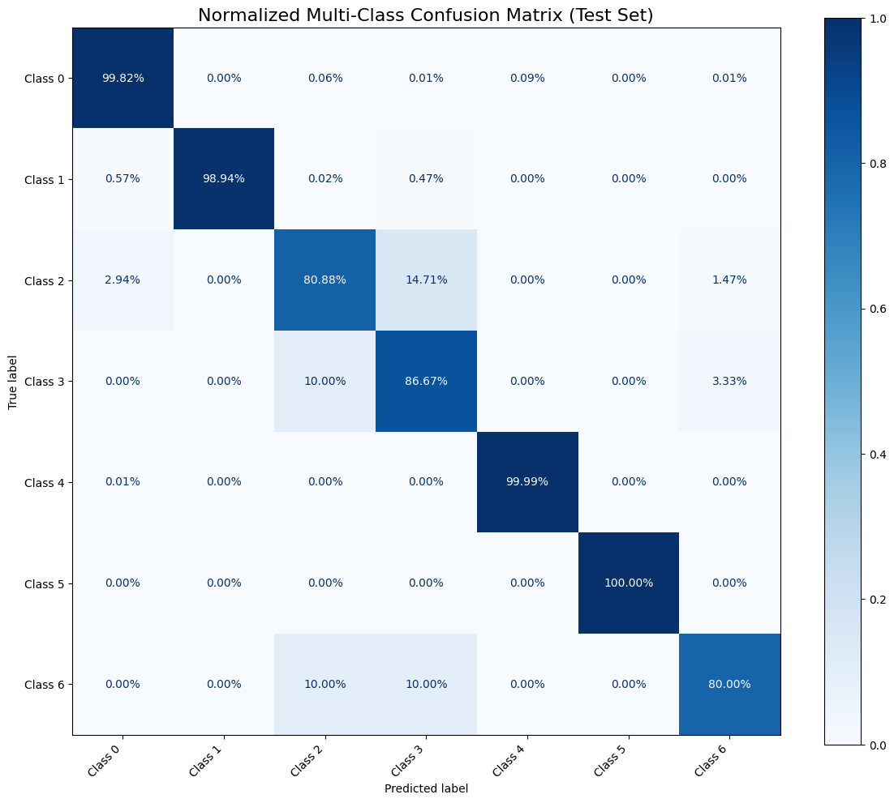

# Deep Learning for Anomaly Based Intrusion Detection: A Hybrid CNN-Autoencoder Approach
### 

> This Project addresses the critical challenges of network intrusion detection by utilizing sophisticated deep learning architectures and a proposed hybrid model to analyse the complex and highly imbalaned CICIDS2018 dataset. Following an intensive feature extraction with Random Forest classifier, with feature scaling and upsampling with Synthetic Minority Oversampling Technique(SMOTE), the pipeline takes the processed dataset to Convolutional Neural Network and Autoencoder based model to find the optimal solution in detecting anomaly intrusion efficiently. The resulting system demonstrates exceptional performance and a robust and reliable intrusion detection solution. 

---

## Table of Contents
- [Overview](#overview)
- [Key Results](#key-results)
- [Method & Pipeline](#method--pipeline)
- [Repository Structure](#repository-structure)
- [Dataset](#dataset)
- [Setup](#setup)

---

## Overview
This project builds an anomaly based Intrusion Detection System (IDS) using the **CICIDS2018** dataset. In this study, the things covered were:
- Cleaning and preparing traffic flows,
- **Selecting 40 features** via Random Forest,
- **Scaling** with StandardScaler,
- Addressing imbalance with **SMOTE** (train-only),
- Training a **Conv1D CNN** for binary/multi-class known attacks,
- Training an **Autoencoder (AE)** on *benign-only* for anomaly detection via reconstruction error,
- Combine both in a **hybrid model**: high confidence CNN → known class; else AE threshold → **ZERO_DAY**; otherwise BENIGN.


---

## Key Results
**Data splits**
- Total: **2,192,355** samples  
- Train/Test (80/20): **1,753,609 / 438,403**  
- From Train → Train/Val (90/10 from Train): **1,490,567 / 263,042**

**CNN — Binary (Benign vs Attack)**
- **Accuracy:** 99.85%  
- **Recall:** 99.71%  
- **Precision:** 98.83%  
- **F1:** 99.27%  
- **Macro AUC:** 99.98% (val), 99.74% (test)


---

**CNN — Multi-class** (7 classes)  
- Very high on major classes (e.g., Benign ≈ 99.82%, DoS-Hulk ≈ 99.99%, SlowHTTPTest ≈ 100%); confusion mainly between *Brute Force-Web* and *Brute Force-XSS*.

| Class No. | Label                  | Accuracy (Recall %) |
|-----------|------------------------|----------------------|
| **0**     | Benign                 | 99.82%              |
| **1**     | Bot                    | 98.94%              |
| **2**     | Brute Force – Web      | 80.88%              |
| **3**     | Brute Force – XSS      | 86.67%              |
| **4**     | DoS – Hulk             | 99.99%              |
| **5**     | DoS – SlowHTTPTest     | 100.00%             |
| **6**     | SQL Injection          | 80.00%              |



---

**Autoencoder — Anomaly (binary)**
- **Accuracy:** 95.7%  
- **Precision:** 76.1%  
- **Recall:** 98.4%  
- **F1:** 85.8%


---

**Hybrid — Anomaly (binary)**
- **Accuracy:** 98.82% 
- **Precision:** 98.82%  
- **Recall:** 98.36%
- **F1:** 99.27% 
- **AUC:** ≈ 0.999


---

## Method & Pipeline
1. **Cleaning:** drop null/∞ rows, remove duplicates, encode categorical, cast to numeric.
2. **Labeling:** keep `Label` (string) and `Label_enc` (int).
3. **Split:** Train/Test (80/20) → Train/Val (90/10 from Train).
4. **Feature Selection:** RandomForest ranks features → keep **top 40**.
5. **Scaling:** `StandardScaler` fit on Train-Fit (selected features), transform Val/Test.
6. **Imbalance:** **SMOTE** on scaled Train-Fit only.
7. **CNN:** Conv1D stack (64/128/256), GAP + Dense, softmax.
8. **AE:** Dense AE (64→32→**8** bottleneck→32→64), MSE loss; threshold τ_AE from benign validation (≈99th percentile).
9. **Hybrid:** if `p_max ≥ τ_CNN` → CNN class; else if `AE_err ≥ τ_AE` → **ZERO_DAY**; else **BENIGN**.

---

## Repository Structure
```
root
├── artifacts
    ├── models
        ├── ae_model.keras
        ├── cnn_model.keras
    ├── extracted_features_bundle.joblib
    ├── splits_bundle.joblib
    ├── standard_scaler_bundle.joblib
├── images
├── plots
├── src
    ├── CNN_model.ipynb
    ├── Hybrid_model.ipynb
    ├── data-preprocessing.ipynb
    ├── exploring_CICIDS2018_dataset.ipynb
    ├── feature_extraction_and_scaling.ipynb
├── .gitignore
├── README.md
├── requirements.txt

```


---

## Dataset
- **CICIDS2018** (Canadian Institute for Cybersecurity). 
- This is a public dataset and available on the [CIC Website](https://www.unb.ca/cic/datasets/ids-2018.html)
- This dataset has 10 csv files capturing traffic flows in 10 different days with 14 attack classes. 
- For this project, combined the three Friday CSVs for training/evaluation.  
- Labels used (7 classes):  
  `0 Benign, 1 Bot, 2 Brute Force - Web, 3 Brute Force - XSS, 4 DoS - Hulk, 5 DoS - SlowHTTPTest, 6 SQL Injection`.

| Class Number | Label Name             |
|--------------|------------------------|
| 0            | Benign                 |
| 1            | Bot                    |
| 2            | Brute Force - Web      |
| 3            | Brute Force - XSS      |
| 4            | DoS - Hulk             |
| 5            | DoS - SlowHTTPTest     |
| 6            | SQL Injection          |


---

## Setup
**Python**: 3.10+  
**GPU**: project was trained on NVIDIA A100 in Google Colaboratory Pro plan

```bash
# clone
git clone https://github.com/Birkbeck/msc-project-source-code-files-24-25-tanveer-99.git
cd msc-project-source-code-files-24-25-tanveer-99

# create environment (optional but recommended)
python -m venv .venv 
.venv\Scripts\Activate.ps1 # On macOS/Linux:
source .venv/bin/activate  # Windows: .venv\Scripts\activate

# Make sure pip is up to date
python -m pip install --upgrade pip

# install
pip install -r requirements.txt
```

To reconstruct the results, run the notebooks in this order.
- Run the feature_extraction_and_scaling notebook first. This will process the cleaned dataset and find the best features and save them in the joblib files, which will be used for the other notebooks. Fix the directory path for the joblib files.
- Run the CNN_model notebook next, it will save the model after training
- Then run the Hybrid_model notebook next to train the AE model and hybrid model to produce evaluation reports

---

In the `artifacts` folder, the joblib files are created. Because these files are very large, they are uploaded to this [Google drive link](https://drive.google.com/drive/folders/1rXfWz_JDG5E5VEPpD8vQhi_WzCQgz2qY?usp=sharing) along with the actual dataset and the cleaned version also.

